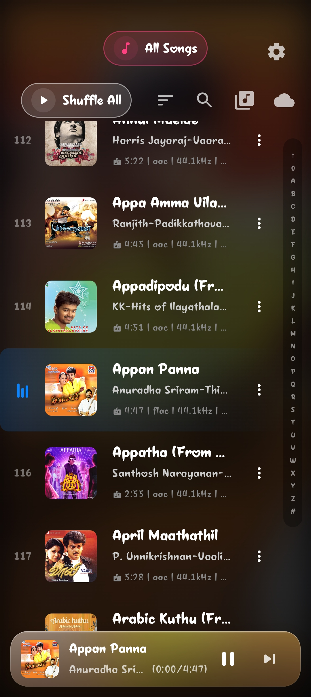
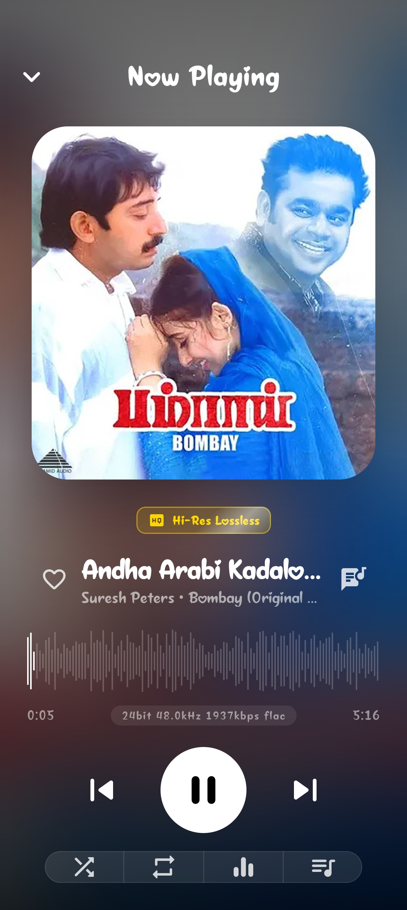
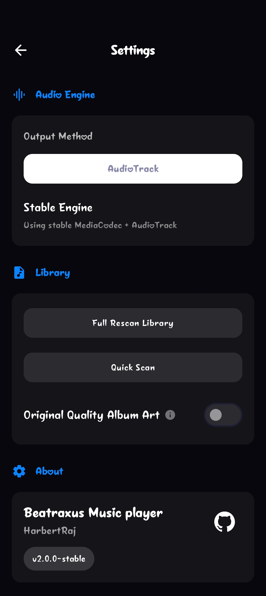

# Beatraxus

Beatraxus is a high-performance Android music player designed for audiophiles. It features a custom audio engine built on Media3 ExoPlayer with integrated resampling and equalization capabilities.

## Screenshots

<p align="center">
  
  
  
</p>

## Features

- **High-Resolution Audio Support**: Custom audio pipeline using `DefaultAudioSink` with float output via a custom `RenderersFactory`.
- **Real-time Resampling**: Adjustable resampling to match your output device's capabilities (Native vs Hi-Res).
- **10-Band Equalizer**: Fine-tune your listening experience with precise gain control.
- **Modern UI**: Built entirely with Jetpack Compose following Material 3 guidelines.
- **Compact Playback Controls**: A refined, space-efficient Now Playing section with rotating album art and smooth animations.
- **Dynamic Theme**: Dark-centric aesthetic with vibrant accents (Accent Red & Accent Blue).
- **Audio Info Bar**: Real-time display of input/output sample rates, bit depth, and active output device.

## Technical Details

- **Language**: Kotlin
- **UI Framework**: Jetpack Compose (Material 3)
- **Audio Engine**: AndroidX Media3 (ExoPlayer)
- **Audio Processing**: Custom `AudioProcessor` implementation for real-time effects.
- **Architecture**: MVVM with StateFlow, Coroutines, and Opt-in for Unstable Media3 APIs.
- **Min SDK**: 26 (Android 8.0)
- **Target SDK**: 34 (Android 14)

## Getting Started

### Prerequisites

- Android Studio Iguana (2023.2.1) or newer
- JDK 17
- Android device or emulator running SDK 26+

### Build and Run

1. Clone the repository:
   ```bash
   git clone https://github.com/yourusername/Beatraxus.git
   ```
2. Open the project in Android Studio.
3. Wait for Gradle sync to complete.
4. Run the `app` module on your device.

## Project Structure

- `:app`: Main application module.
  - `com.beatflowy.app.engine`: Core audio processing logic (`Resampler`, `Equalizer`, `AudioEngine`, `OutputManager`).
  - `com.beatflowy.app.ui.screens`: Main application screens (`MainScreen`, `EqualizerScreen`).
  - `com.beatflowy.app.ui.components`: Reusable UI components (`NowPlayingSection`, `AudioInfoBar`, `SongListItem`).
  - `com.beatflowy.app.ui.theme`: Design system (Colors, Type, Theme).
  - `com.beatflowy.app.viewmodel`: State management and business logic.

## License

This project is licensed under the MIT License - see the [LICENSE](LICENSE) file for details.
