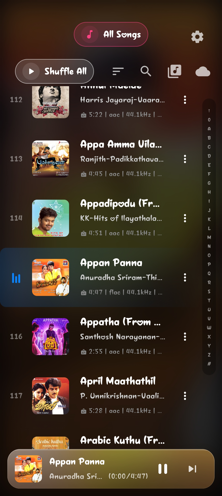
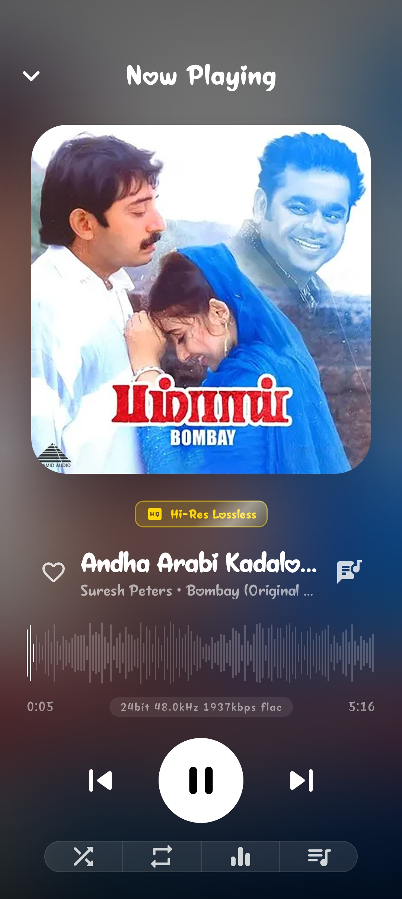
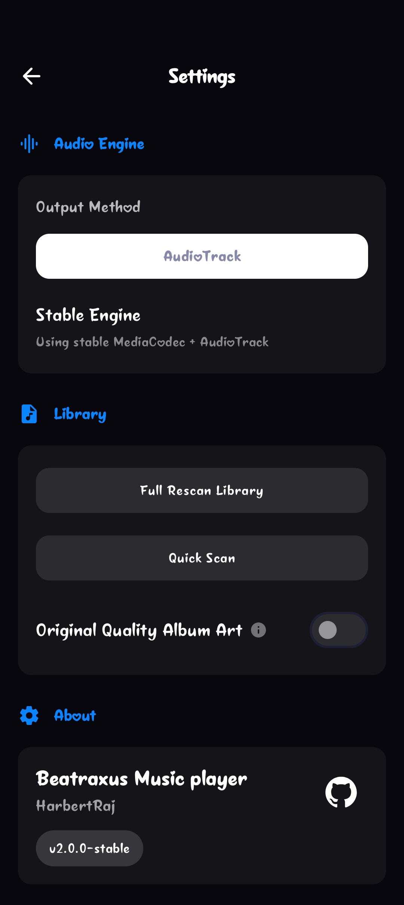

# Beatraxus

Beatraxus is a high-performance Android music player designed for audiophiles. It features a custom low-latency audio engine built on AudioTrack with integrated resampling and equalization capabilities.

## Screenshots

<p align="center">
  
  
  
</p>

## Features

- **High-Resolution Audio Support**: Custom audio pipeline using `AudioTrack` with float output for maximum fidelity.
- **Real-time Resampling**: Adjustable resampling to match your output device's capabilities (Native vs Hi-Res).
- **10-Band Equalizer**: Fine-tune your listening experience with precise gain control.
- **Modern UI**: Built entirely with Jetpack Compose following Material 3 guidelines.
- **Compact Playback Controls**: A refined, space-efficient Now Playing section with rotating album art and smooth animations.
- **Dynamic Theme**: Dark-centric aesthetic with vibrant accents (Accent Red & Accent Blue).
- **Audio Info Bar**: Real-time display of input/output sample rates, bit depth, and active output device.

## Technical Details

- **Language**: Kotlin
- **UI Framework**: Jetpack Compose (Material 3)
- **Audio Engine**: Custom `AudioTrack`-based engine with native decoding.
- **Audio Processing**: Custom real-time DSP implementation for effects.
- **Architecture**: MVVM with StateFlow and Coroutines.
- **Min SDK**: 26 (Android 8.0)
- **Target SDK**: 34 (Android 14)

## Getting Started

### Prerequisites

- Android Studio Iguana (2023.2.1) or newer
- JDK 17
- Android device or emulator running SDK 26+

### Build and Run

1. Clone the repository:
   ```bash
   git clone https://github.com/yourusername/Beatraxus.git
   ```
2. Open the project in Android Studio.
3. Wait for Gradle sync to complete.
4. Run the `app` module on your device.

## Project Structure

- `:app`: Main application module.
  - `com.beatflowy.app.engine`: Core audio processing logic (`Resampler`, `Equalizer`, `AudioEngine`, `OutputManager`).
  - `com.beatflowy.app.ui.screens`: Main application screens (`MainScreen`, `EqualizerScreen`).
  - `com.beatflowy.app.ui.components`: Reusable UI components (`NowPlayingSection`, `AudioInfoBar`, `SongListItem`).
  - `com.beatflowy.app.ui.theme`: Design system (Colors, Type, Theme).
  - `com.beatflowy.app.viewmodel`: State management and business logic.

## License

This project is licensed under the MIT License - see the [LICENSE](LICENSE) file for details.
## ARCHITECTURE DIAGRAM

┌─────────────────────────────────────────────────────────────────────────────┐
│                          AudioPlaybackService                                │
│  (Foreground Service — MediaSession, Notification, OS lifecycle)             │
│                              ↓ controls                                      │
│                         PlayerViewModel                                      │
│  (UI state, DspConfig, queue management, skip/seek/shuffle/repeat)           │
│                              ↓ updateDspConfig / play / seek                 │
│                           AudioEngine                                        │
│  ┌────────────────────────────────────────────────────────────────────────┐  │
│  │  engineScope (Dispatchers.Default + SupervisorJob)                     │  │
│  │  controlMutex (Mutex) — guards session creation/promotion/stop         │  │
│  │                                                                        │  │
│  │  play() / pause() / resume() / stop() / seekTo() / preloadNext()      │  │
│  │                                                                        │  │
│  │  ┌─────────────────┐    ┌─────────────────┐                           │  │
│  │  │  activeSession  │    │   nextSession    │  (gapless pre-buffer)     │  │
│  │  │  PlaybackSession│    │  PlaybackSession │                           │  │
│  │  └────────┬────────┘    └────────┬────────┘                           │  │
│  │           │                      │                                     │  │
│  │   DecoderFactory.create(song)    │                                     │  │
│  │       ↓              ↓           │                                     │  │
│  │  FfmpegAlacDecoder  MediaCodecAudioDecoder                             │  │
│  │  (ALAC,cloud WAV,   (FLAC,MP3,AAC,                                    │  │
│  │   cloud M4A)         OGG,local WAV…)                                  │  │
│  │       ↓              ↓                                                 │  │
│  │    FloatArray (PCM f32) written to DecoderSink                        │  │
│  │       ↓                                                                │  │
│  │  FloatRingBuffer (262,144 samples — ~5.4s at 48kHz stereo)            │  │
│  │       ↓   read by renderLoop (IO dispatcher, URGENT_AUDIO priority)   │  │
│  │  AudioDspPipeline.process(4096-sample batch)                          │  │
│  │       ↓                                                                │  │
│  │  NativeDspProcessor → JNI → libbeatraxus_dsp.so (C++)                │  │
│  │  Chain (native):                                                       │  │
│  │    DC Blocker → ReplayGain → Preamp → EQ (32-band parametric)         │  │
│  │    → Tone → Spatial → Crossfeed → Reverb → DVC → Limiter              │  │
│  │    → Dither → SoXR Resample                                            │  │
│  │       ↓                                                                │  │
│  └──────────────────────────────────────────────────────────────────────┘  │
│                              ↓                                               │
│                       AudioOutput (interface)                                │
│                              ↓                                               │
│                      AudioTrackOutput                                        │
│  ┌────────────────────────────────────────────────────────────────────────┐  │
│  │  Mode: AAudio (ENCODING_PCM_FLOAT, hardware native rate)               │  │
│  │     or MTK HiFi (direct path, best encoding, source rate)              │  │
│  │  DVC: AudioTrack.setVolume() — currently ALWAYS 1.0f                  │  │
│  │  PCM conversion: toPcm16/24/32 (float→integer, TPDF dither)           │  │
│  │  Underrun tracking, playback head wrap-around correction               │  │
│  └────────────────────────────────────────────────────────────────────────┘  │
│                              ↓                                               │
│                    Android AudioTrack → HAL → DAC                           │
└─────────────────────────────────────────────────────────────────────────────┘