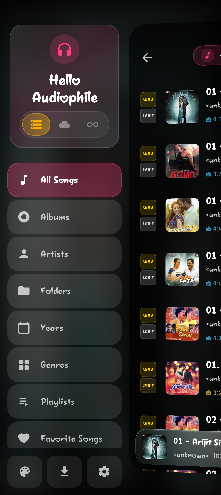
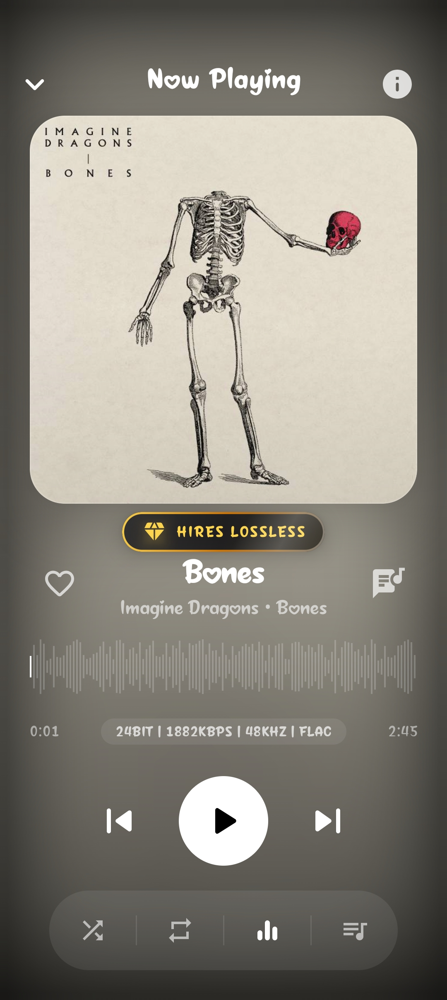
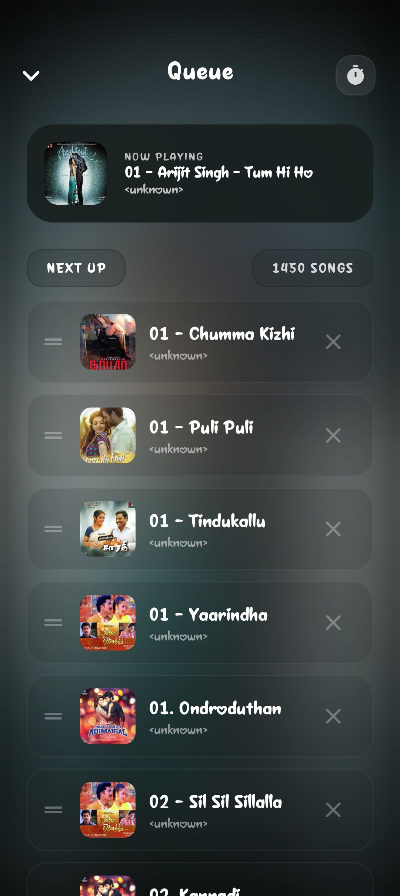
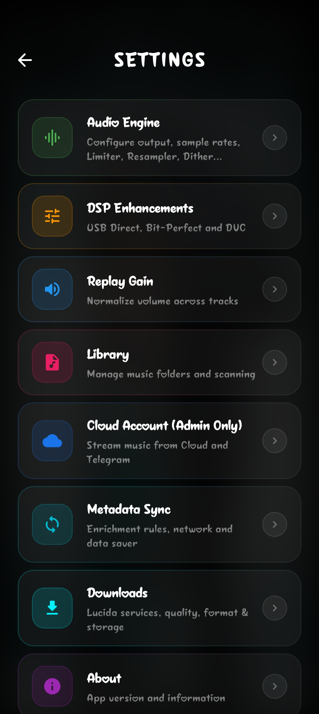
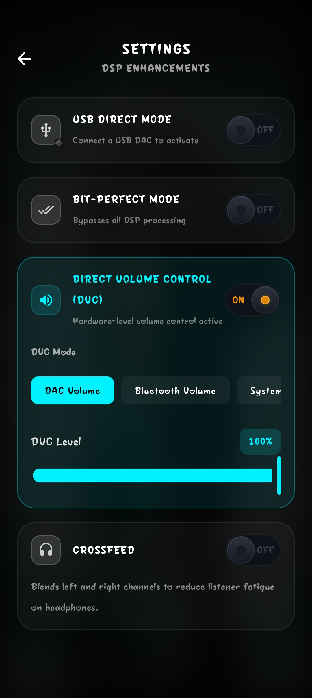
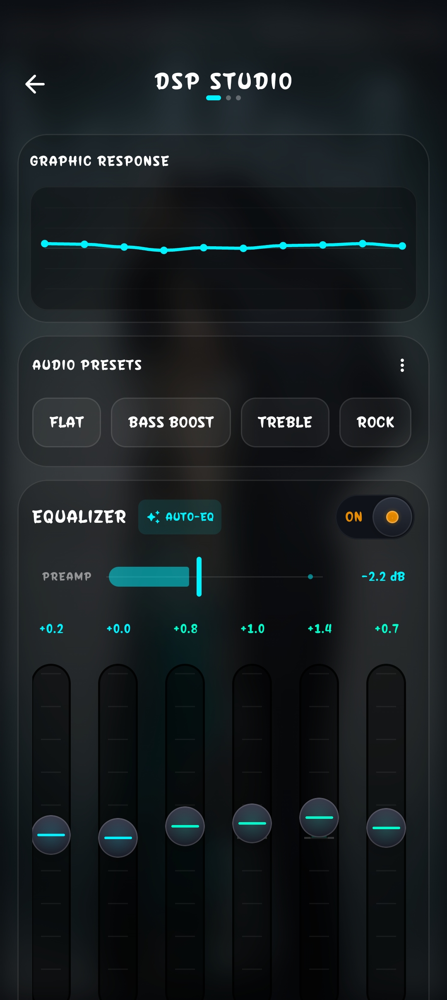
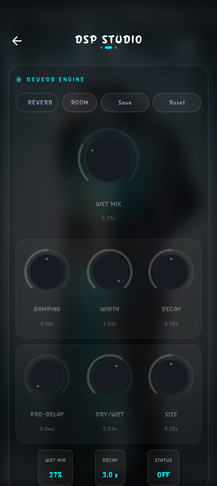
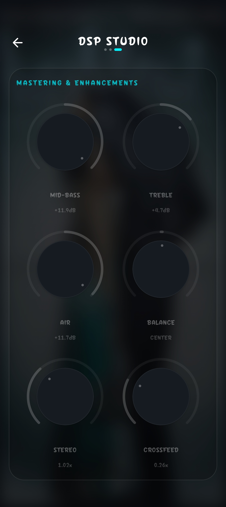

# Beatraxus

Beatraxus is a high-performance Android music player designed for audiophiles. It features a custom low-latency audio engine built on AudioTrack with integrated resampling and equalization capabilities.

## Screenshots

<p align="center">
  
  
  
</p>
<p align="center">
  
  
  
</p>
<p align="center">
  
  
</p>

## Features

- **Bit-Perfect Mode**: Bypasses the Android audio mixer and all DSP for untouched, bit-perfect audio delivery to your hardware.
- **USB Direct Output**: Support for external USB DACs with direct hardware access, bypassing system limitations.
- **Advanced DSP Engine**: Custom real-time processing chain including a 10-band Equalizer, Reverb Engine, Crossfeed, and Mastering tools.
- **High-Resolution Support**: Native playback support for FLAC, ALAC, WAV, and more at up to 32-bit/384kHz+.
- **Auto-EQ Integration**: Search and apply optimized EQ profiles for over 4,000 headphone models from the AutoEQ database.
- **Modern UI**: A sleek, dark-centric interface built with Jetpack Compose, featuring glass-morphism and dynamic album art backgrounds.
- **Cloud & Telegram Streaming**: Stream your music directly from Google Drive or Telegram channels.
- **Integrated Downloader**: High-quality music downloads powered by Lucida services (Qobuz, Tidal, Deezer, etc.).

## Technical Details

- **Language**: Kotlin
- **UI Framework**: Jetpack Compose (Material 3)
- **Audio Engine**: Custom `AudioTrack`-based engine with native decoding.
- **Audio Processing**: Custom real-time DSP implementation for effects.
- **Architecture**: MVVM with StateFlow and Coroutines.
- **Min SDK**: 26 (Android 8.0)
- **Target SDK**: 34 (Android 14)

## Getting Started

### Prerequisites

- Android Studio Iguana (2023.2.1) or newer
- JDK 17
- Android device or emulator running SDK 26+

### Build and Run

1. Clone the repository:
   ```bash
   git clone https://github.com/yourusername/Beatraxus.git
   ```
2. Open the project in Android Studio.
3. Wait for Gradle sync to complete.
4. Run the `app` module on your device.

## Project Structure

- `:app`: Main application module.
  - `com.beatflowy.app.engine`: Core audio processing logic (`Resampler`, `Equalizer`, `AudioEngine`, `OutputManager`).
  - `com.beatflowy.app.ui.screens`: Main application screens (`MainScreen`, `EqualizerScreen`).
  - `com.beatflowy.app.ui.components`: Reusable UI components (`NowPlayingSection`, `AudioInfoBar`, `SongListItem`).
  - `com.beatflowy.app.ui.theme`: Design system (Colors, Type, Theme).
  - `com.beatflowy.app.viewmodel`: State management and business logic.

## License

This project is licensed under the MIT License - see the [LICENSE](LICENSE) file for details.
